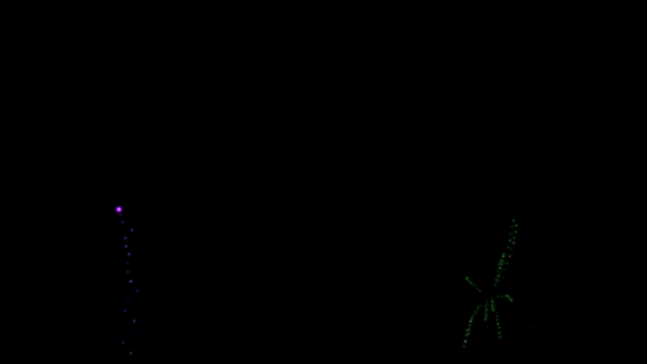

# 🎆 FireworksGL.scr 🎆

*A reimplementation of my [FireworksGL.scr Screensaver](https://github.com/atom-dispencer/Fireworks.scr)
    in pure C and OpenGL (with [GLFW](https://github.com/glfw/glfw) and [GLAD](https://github.com/Dav1dde/glad) 
    for good measure).
My eternal graditude to [RenderDoc](https://renderdoc.org/) for making OpenGL easily debuggable, and to 
    [LearnOpenGL](https://learnopengl.com) for being a good teacher!.*

A screensaver for Windows which makes pretty fireworks 😊🎆

This was somewhat inspired by a [Dave's Garage video](https://www.youtube.com/watch?v=-foAV_zU2as)
   about making a Matrix-style screensaver for the PDP-11/83.

## Usage

1) Grab `FireworksGL.scr` from the Releases page (or build it yourself).
2) Place `FireworksGL.scr` in your `System32` (e.g. `C:/Windows/System32/`).
3) Select `Fireworks` in the Control Panel (Just search `screensaver` 
   or `change screen saver` or something like that in your search bar or 
   start menu).

I suggest turning the wait down as low as possible so you get to see the
   fireworks most often!

The screensaver automatically closes when you click any button, but *not*
   if you just move the mouse because I personally find that annoying.

## Options

**/s** - Run the screensaver full screen.

**/p** - Run the screensaver in preview/debug mode (windowed.)

*Not yet supported (but you don't need them anyway):*

**/?** - Show a help dialogue with these options.

**/c** - Show a configuration dialogue. No options currently supported.
