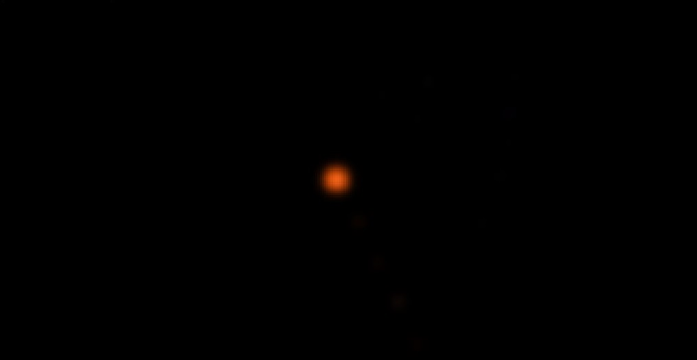
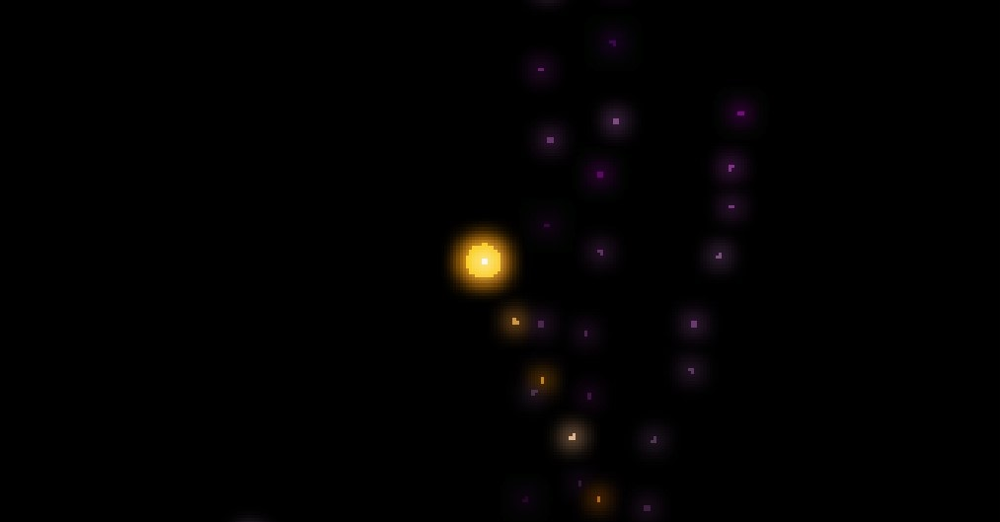

# 🎆 FireworksGL.scr 🎆

*A reimplementation of my [FireworksGL.scr Screensaver](https://github.com/atom-dispencer/Fireworks.scr)
    in pure C and OpenGL (with [GLFW](https://github.com/glfw/glfw) and [GLAD](https://github.com/Dav1dde/glad) 
    for good measure).
My eternal graditude to [RenderDoc](https://renderdoc.org/) for making OpenGL easily debuggable, and to 
    [LearnOpenGL](https://learnopengl.com) for being an excellent teacher!*

A screensaver for Windows which makes pretty fireworks 😊🎆

This was somewhat inspired by a [Dave's Garage video](https://www.youtube.com/watch?v=-foAV_zU2as)
   about making a Matrix-style screensaver for the PDP-11/83.

If you don't care about how the thing works and just want to use it, skip to 
    [#Usage](#Usage).

## Simulation

The simulation runs at the same 'frame rate' as the graphics, but velocities
    are adjusted with the time delta (with the exception of graphical/erratic
    motion, but that seems stable enough without compensation).

There are three particle types:
- *Rockets*, which shoot up from the bottom of the screen, leaving a trail of
    *Haze*, and burst into several *Sparks*.
- *Sparks*, which are thrown off of exploding *Rockets*, leaving trails of
    *Haze* before fading away.
- *Haze*, which has extra high simulated drag so it stops quickly and falls
    slowly down as it fades...

Each particle type has a unique lifetime, after which it is available to be
    revived as a new particle later.
Particles which go too far (>50 pixels) out of bounds are culled immediately.

A maximum of 1 rocket can exist at once (defined by the `MAX_ROCKETS` constant)
    to prevent the screen becoming too busy, and a maximum of 250 total
    particles of any type (`MAX_PARTICLES`).
If more particles would be required, haze particles are deleted and replaced
    first.
If no haze is available, a random particle would be selected for
    culling/replacement, but I've never seen this happen in the wild before.

## Rendering Pipeline

OpenGL 4.6 is used for graphics, GLFW for the window, and GLAD to load OpenGL 
    bindings.

Let's walk through a single rendering pass!
VSync is enabled by default (it's a screensaver... you don't need 1000s FPS),
    so for me this is happening 144 times per second!
In fact, in RenderDoc (so on the *slow* end) with VSync disabled my Nvidia GTX 
    3070 and i7-9700 pull off around 1550 FPS!

Take, for example, this rocket with a bit of its own orange haze beneath it and
    some faint pink haze in the background:

### Stage 1) Clear the screen black

Cover the land (geometry framebuffer) in darkness...

### Stage 2) Draw particle geometry (circles)

For each particle, draw a circle with its colour at its current location.
All particles share the same geometry, but the number, position and colour of 
    particles change, so the draw operation is instanced and uses an 
    Element Buffer Object to remove the need to resend particle geometry data
    to the GPU.

### Stage 3) Draw particle cores (points)

For each rocket, a white point is draw at its centre using the `GL_POINTS`
    drawing mode.

### Stage 4) Bloom

Bloom can be safely applied to the whole image (no lighting threshold required!)
    because the only bright things are the fireworks!

#### Stage 4a) Apply gaussian blur

In a seperate High Dynamic Range (HDR) framebuffer, a few passes of Gaussian 
    blur are applied to the whole image.
A fragment shader averages each pixel with its vertical, then horizontal,
    neighbours using a 5-wide weighting matrix (applied symmetrically
    around each texel, so effectively 11-wide).

#### Stage 4b) Merge geometry and blur buffers

The blurred texture is added to the geometry texture to create the famous
    "bloom" effect.
Tonemapping is applied at the same time...

#### Stage 4c) Tonemapping

The bloom effect's HDR framebuffer can have colour values outside the normal
    0-1 range, so it needs to be converted back to standard RGB or we'll get
    hotspots in the final image.
To do this, we apply a fixed exposure value, correct the gamma the standard
    2.2, and apply a Reinhard tonemapping function to bring our HDR image
    back to the Low Dynamic Range.

### Stage 5) Render to screen

🎆 *Ta-da!* 🎆 

## Usage

1) Grab `FireworksGL.scr` from the Releases page (or build it yourself).
2) Place `FireworksGL.scr` in your `System32` (e.g. `C:/Windows/System32/`).
3) Select `FireworksGL` in the Control Panel (Just search `screensaver` 
   or `change screen saver` or something like that in your search bar or 
   start menu).

I suggest turning the wait down as low as possible so you get to see the
   fireworks most often!

The screensaver automatically closes when you click any button, but *not*
   if you just move the mouse because I personally find that annoying.

## Options

**/s** - Run the screensaver full screen.

**/p** - Run the screensaver in preview/debug mode (windowed.)

*Not yet supported (but you don't need them anyway):*

**/?** - Show a help dialogue with these options.

**/c** - Show a configuration dialogue. No options currently supported.
